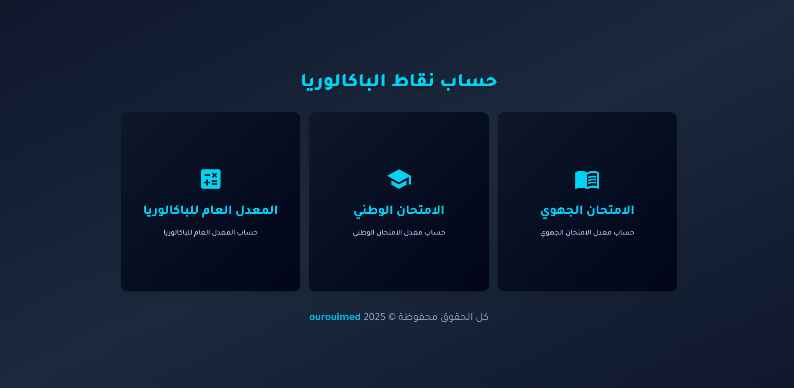
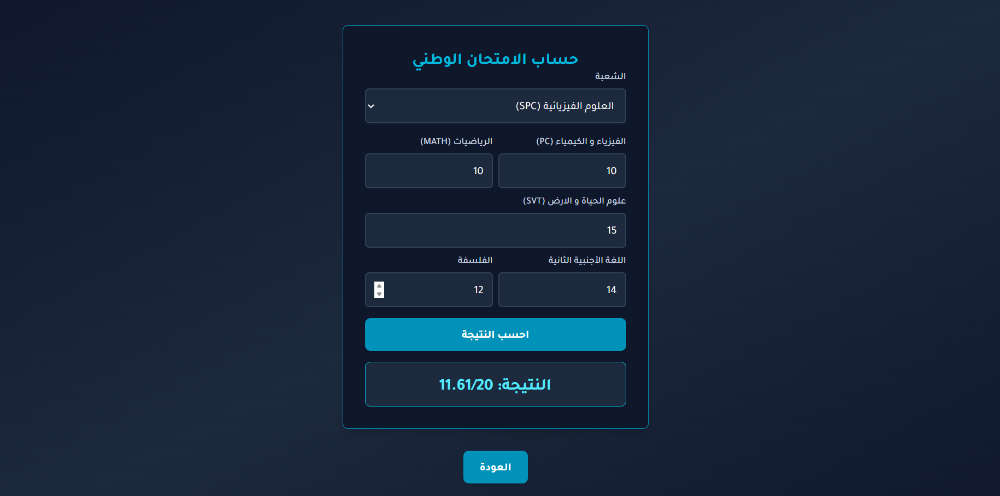
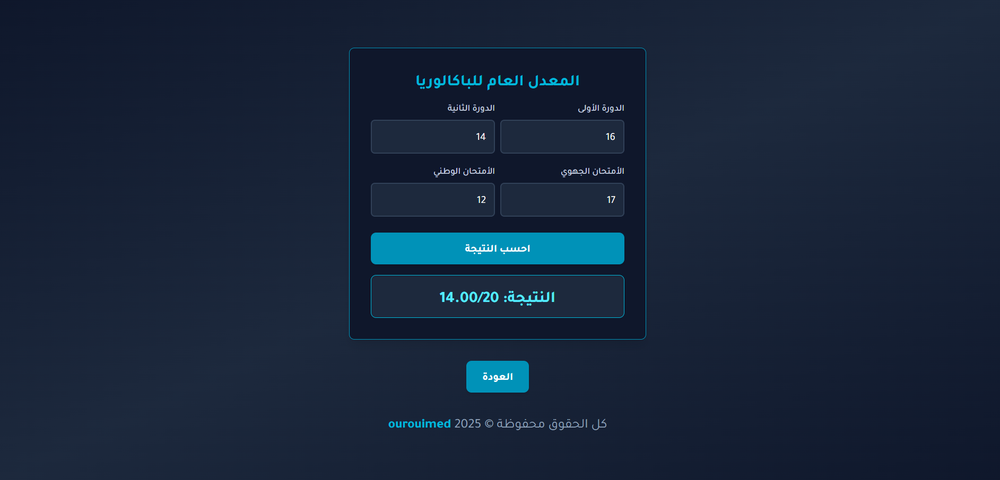

<h1>🧮 تطبيق حساب المعدل العام للباكالوريا</h1>
    

      هذا التطبيق يساعد التلاميذ المغاربة على حساب <strong> معدل الامتحان الوطني و الجهوي</strong> و <strong>المعدل العام للباكالوريا</strong> بسهولة، حسب الشعبة والمعاملات الخاصة بكل مادة.
    

  <h2>💡 المميزات</h2>
  <ul>
    <li>حساب معدل الامتحان الوطني بناءً على المعاملات الرسمية.</li>
    <li>دعم مختلف الشعب: SPC, SVT, SMA, SMB, SAGRO, SE, SGC, LT, SH.....</li>
    <li>حساب المعدل العام للباكالوريا</li>
  </ul>

  <h2>🧱 التقنيات المستعملة</h2>
  <ul>
    <li>React.js + Vite</li>
    <li>TailwindCSS</li>
  </ul>

  <h2>📦 طريقة الاستخدام</h2>
  <ol>
    <li>اختر النقطة التي تريد حسابها (وطني - جهوي - المعدل العام)</li>
    <li>اختر الشعبة من القائمة المنسدلة.</li>
    <li>أدخل النقط الخاصة بالمواد المطلوبة.</li>
    <li>اضغط على زر <strong>احسب النتيجة</strong>.</li>
    <li>ستظهر النتيجة النهائية في الأسفل.</li>
  </ol>

  <h2>✅ شروط الإدخال</h2>
  <ul>
    <li>يجب أن تكون جميع النقاط بين <code>0</code> و <code>20</code>.</li>
    <li>إذا تم إدخال قيمة خاطئة، تظهر رسالة خطأ للتنبيه.</li>
  </ul>

  <h2>📁 هيكل المشروع</h2>
  <pre>
src/
├── components/
│   ├── National.jsx
│   ├── MoyenneBac.jsx
│   └── National/ # العناصر الخاصة بشعب الامتحان الوطني
│       ├── SPC.jsx
│       ├── SMA.jsx
│       └── ...
│   └── Regional / # العناصر الخاصة بشعب الامتحان الجهوي
│       ├── SXM.jsx
│       ├── SLH.jsx
│       └── ...
├── App.jsx
├── index.css # tailwindcss
└── main.jsx
  </pre>

  

  <h2> صور المشروع</h2> 
   
   
   

  

    للمزيد , زر الموقع التالي <a href='https://bac2025.vercel.app/' target='_blank' >Live Demo</a>
  

  <h2>🙋‍♂️ المطور</h2>
  

    تم تطوير هذا المشروع لمساعدة التلاميذ المغاربة على حساب معدلاتهم بشكل دقيق ومنظم. مرحباً بجميع الاقتراحات أو المساهمات على GitHub.
  

</body>
</html>
